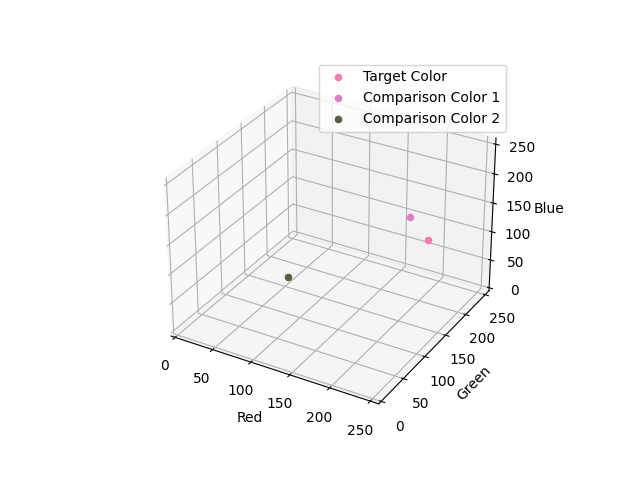

# Detect Color Difference with TCS3200

Table of Contents
- [Project Overview](#project-overview)
- [Getting Started](#getting-started)
- [Project Structure](#project-structure)
- [Configuration](#configuration)
- [Usage](#usage)
- [Customization](#customization)
- [Resources](#resources)
- [Contributing](#contributing)
- [License](#license)

---

## Project Overview

Color difference is the seperation between two colors. Common definitions of color difference are distance within a color space. The starndard means of determining distance is Euclidean distance.

## Circuit

Explain the necessary steps to get started with the project. Include any dependencies or tools required for development.

## Project Structure

Describe the structure of the project directory and highlight the key files and folders. 

## Configuration

List any configuration files or settings that need to be modified for specific projects. Mention how to modify these files for customization.

## Usage

Explain how to use the project template effectively. Provide guidelines, best practices, and any conventions to follow.

## Customization

Detail the sections or files that can be modified in future projects. Encourage developers to tailor the template to fit their specific needs.

## Resources

If there are any external resources or references relevant to the project, provide links or documentation references here.

## Contributing

Specify guidelines for contributing to the project or encourage users to submit improvements and suggestions.

## License

State the license information for the project.

---

Feel free to modify this .md file as needed to adapt it to your specific project requirements. Remember to update the sections and content accordingly whenever necessary.
